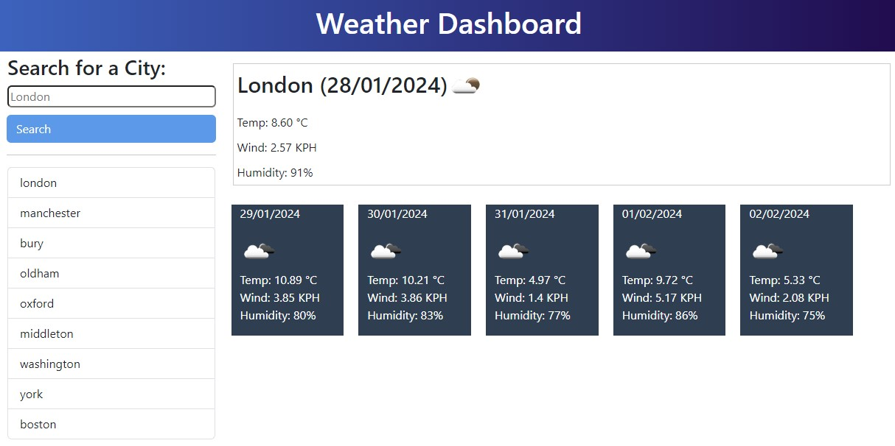
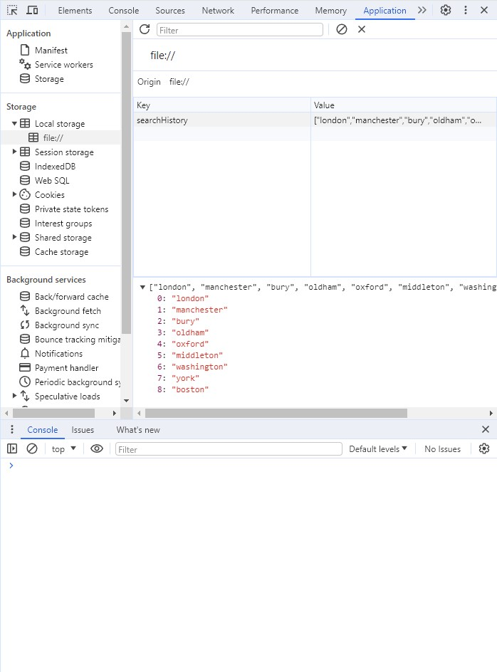

# Weather-Dashboard

## Description

The aim of this project is to create a website that can display s city's weather for the current day and forecast the city's weather for the next 5 days. Searches are saved to buttons which can be clicked on to pull weather for that particular city back up. Data is saved to local storage so that buttons appear each time the website is loaded.

The website can be viewed [here](file:///C:/Users/Andrew/bootcamp/Challenges/week-8/Weather-Dashboard/index.html?)

## Installation

NA

## Usage

Type the name of the city you wish to obtain weather data for into the input form.  Press enter or click on the search button to initiate the search. The name of the city, current date, temperature, wind speed and humidity will be displayed. A 5 day forecast will also be displayed below it with the same data points

## Screenshot
 
 
    
## Credits

- Websites used to review and test javascript commands & tutorials 
    - [w3schools](https://www.w3schools.com/html/default.asp) 
    - [MDN Web Docs](https://developer.mozilla.org/en-US/docs/Learn/HTML)
    - [OpenWeather](https://openweathermap.org/forecast5)
    - [Day.js](https://day.js.org/docs/en/display/format)
    - [Bootstrap](https://getbootstrap.com/docs/5.3/getting-started/introduction/)
- Websites reviewed to help generate a badge - [Shields.io](https://shields.io/badges) & [lukas-h github](https://gist.github.com/lukas-h/2a5d00690736b4c3a7ba)

## License

MIT License

Copyright (c) 2024 Andrew Sinkinson

Permission is hereby granted, free of charge, to any person obtaining a copy of this software and associated documentation files (the “Software”), to deal in the Software without restriction, including without limitation the rights to use, copy, modify, merge, publish, distribute, sublicense, and/or sell copies of the Software, and to permit persons to whom the Software is furnished to do so, subject to the following conditions:

The above copyright notice and this permission notice shall be included in all copies or substantial portions of the Software.

THE SOFTWARE IS PROVIDED “AS IS”, WITHOUT WARRANTY OF ANY KIND, EXPRESS OR IMPLIED, INCLUDING BUT NOT LIMITED TO THE WARRANTIES OF MERCHANTABILITY, FITNESS FOR A PARTICULAR PURPOSE AND NONINFRINGEMENT. IN NO EVENT SHALL THE AUTHORS OR COPYRIGHT HOLDERS BE LIABLE FOR ANY CLAIM, DAMAGES OR OTHER LIABILITY, WHETHER IN AN ACTION OF CONTRACT, TORT OR OTHERWISE, ARISING FROM, OUT OF OR IN CONNECTION WITH THE SOFTWARE OR THE USE OR OTHER DEALINGS IN THE SOFTWARE.

## Badges

